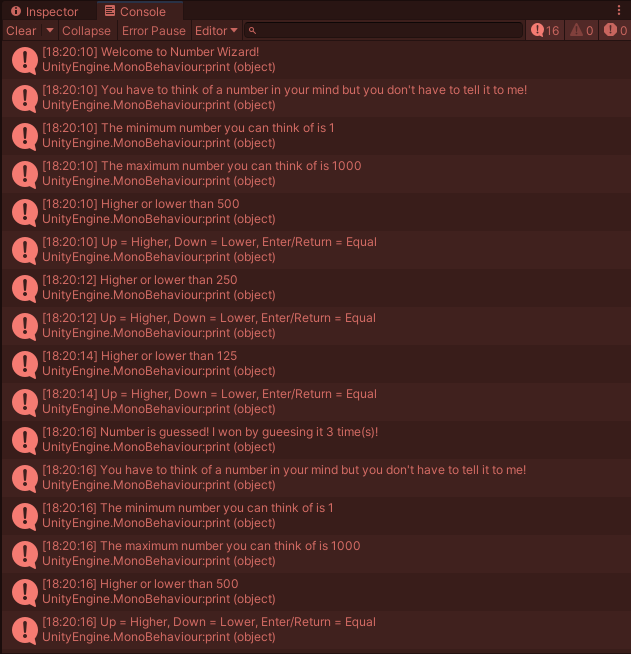

# Unity Game: NumberWizard (Console)
Hi, this is my first Unity Game Project, named "Number Wizard":
<ul>
<li> It is a simple 'guess the number' game</li>
<li> It runs on Console.</li>
<li> Hence, it has no UI and is CLI </li>
<li> Here the player secretly picks a number</li>
<li> The computer attempts to guess with as few attempts as possible.</li>
</ul>

I will also make a UI version of this game

# Screenshot

